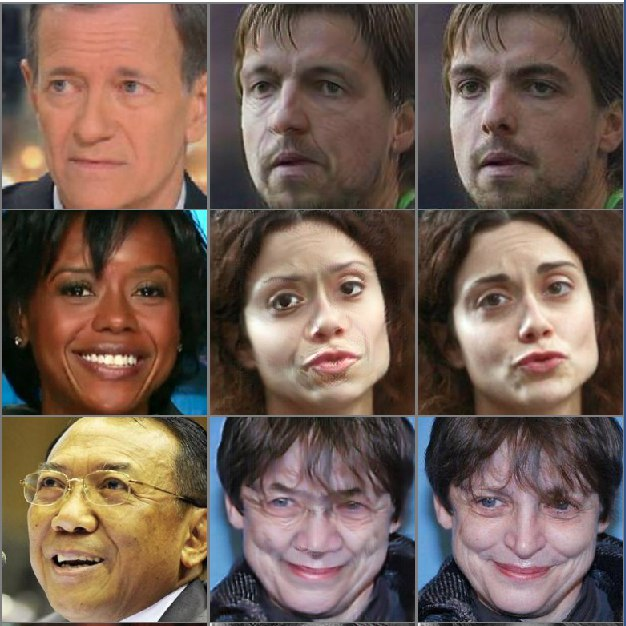
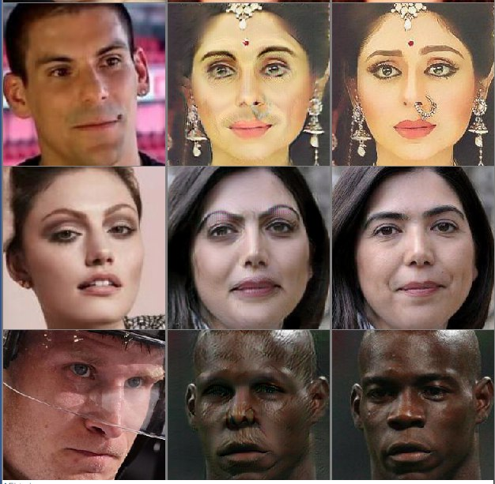

Here I partially reproduced the FaceShifter paper (https://arxiv.org/pdf/1912.13457.pdf) -
a GAN that can take a person's face from one image and insert it instead of a face on another 
image. The paper describes two networks - first stage is generator net itself, 
and second stage is refinement net that makes the results looking nicer in case of occlusions.
This repository contains implementation of only the first stage.  

There are the example results (left - source face, right - target face, 
middle - result of inserting the source face into the target):

Trained models are there: https://drive.google.com/drive/folders/1U6Tw8cC9YIZpA6XtoAnb0NecbXVP6xPI?usp=sharing

Kudos to https://github.com/taotaonice/FaceShifter from which this work is derived. 

P.S.: you need python 3.7 to run the code
